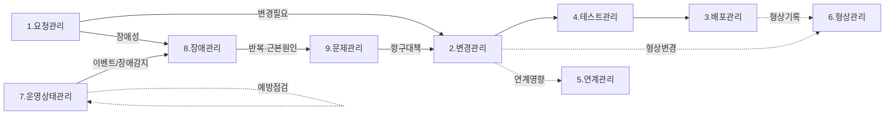
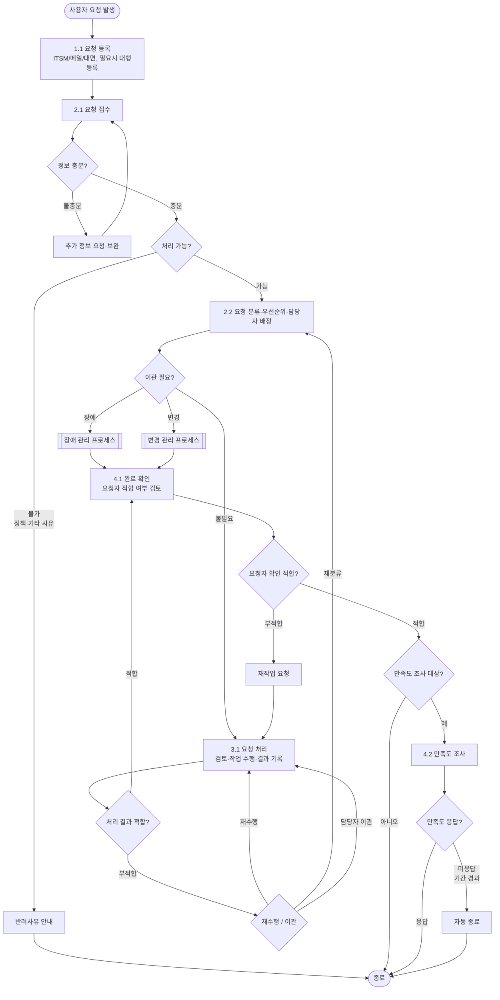
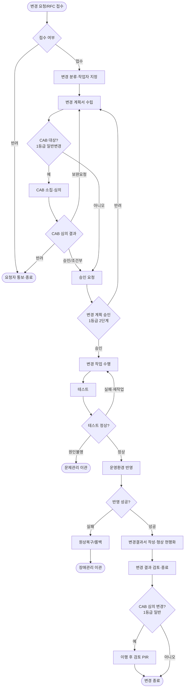
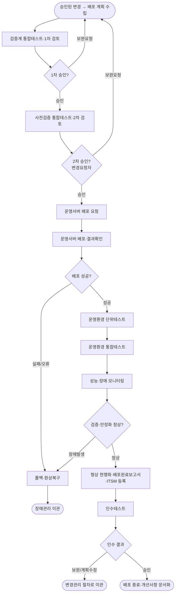
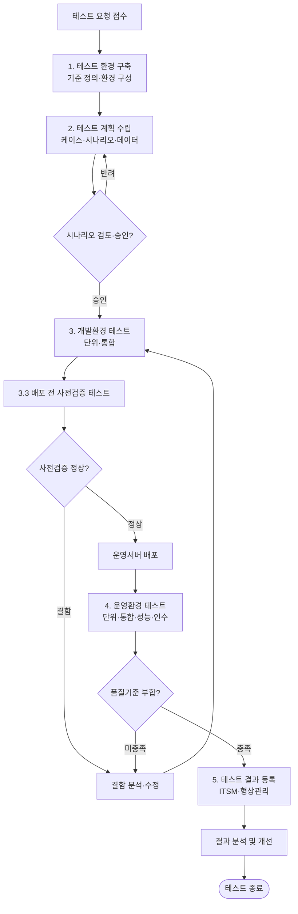
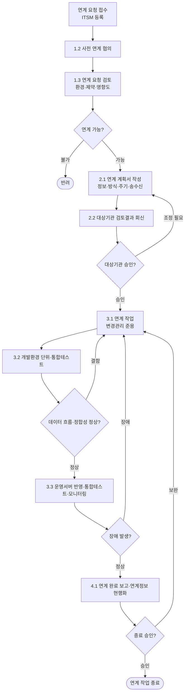
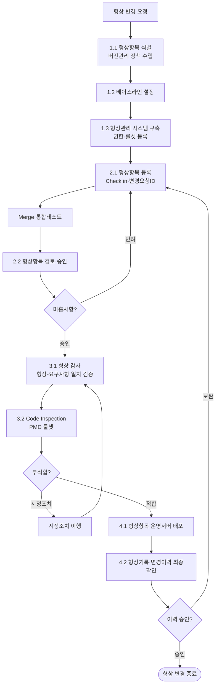
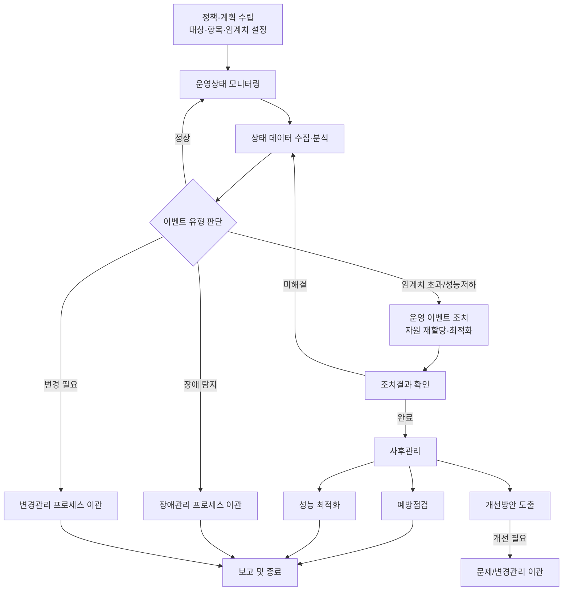
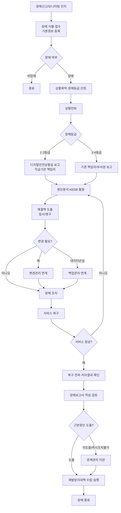
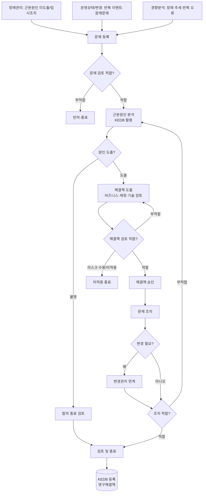

# 응용프로그램 표준운영절차(SOP) 프로세스 설계서

> 출처 분석: 행정안전부 「행정·공공기관 응용프로그램 표준운영절차서」
> 기준: ITIL · ISO/IEC 20000 국제표준 준용
> 목적: 절차서의 9개 표준운영절차를 분석하여 **운영관리시스템의 프로세스(상태흐름)·역할(RACI)·데이터·화면**으로 설계하고, 현행 구현(eGov-Ops)과의 적용/보완 방향을 제시한다.

---

## Ⅰ. 절차 체계 개요

### 1. 목적·적용 범위
- **목적**: 행정·공공기관 정보시스템 응용프로그램(AP)의 운영 효율화와 장애 발생요소 최소화를 위한 표준 운영절차 제공
- **적용 범위**: 행정·공공기관 정보시스템 응용프로그램의 운영관리 활동 전반
- 인프라+AP를 모두 운영하는 기관은 「정보시스템 표준운영절차」와 본 AP 절차를 **병행 적용**

### 2. 9개 표준운영절차 분류

| # | 절차 | 영문 | 분류 | 비고 |
|---|------|------|------|------|
| 1 | 요청 관리 | Customer Service Request Mgmt | 대응 | 범정부 준용 |
| 2 | 변경 관리 | Change Management | 예방 | |
| 3 | 배포 관리 | Release & Deployment Mgmt | 예방 | |
| 4 | 테스트 관리 | Validation & Testing Mgmt | 예방 | |
| 5 | 연계 관리 | Integration Management | 예방 | |
| 6 | 형상 관리 | Operational Configuration Mgmt | 예방 | |
| 7 | 운영상태 관리 | Monitoring & Event Mgmt | 예방 | |
| 8 | 장애 관리 | Incident Management | 대응 | 범정부 준용 |
| 9 | 문제 관리 | Problem Management | 사후관리 | 범정부 준용 |

### 3. 정보시스템 등급별 적용 기준

| 등급 | 적용 절차 | 도입 수준 |
|------|-----------|-----------|
| **1~2등급** | 9개 전체 (변경·배포·테스트·연계·형상·운영상태 + 요청·장애·문제) | **적용 및 도입 의무** |
| **3~4등급** | 6개 (변경·배포·테스트·형상 + 장애·문제) | 적용 및 기록관리 **권고** |

### 4. 절차 간 연계 흐름 (전체 조망)



핵심 연계 규칙:
- **요청 → 변경/장애**: 사용자 요청이 변경작업이면 변경관리로, 장애성이면 장애관리로 이관
- **변경 → 테스트 → 배포**: 변경 승인 후 테스트 검증을 거쳐 배포 수행, 배포 결과는 형상에 기록
- **운영상태 → 장애 → 문제**: 모니터링 이벤트가 장애로 전이, 반복장애/근본원인은 문제로 등록, 항구대책은 변경으로 환류
- **형상관리**: 변경·배포의 대상(CI)을 식별·통제·감사하는 기준정보 축

---

## Ⅱ. 현행 시스템(eGov-Ops) 대비 적용·갭 분석

현재 구현된 운영관리시스템과 절차서 9개 절차의 매핑 현황이다.

| # | 표준운영절차 | 현행 구현 | 상태 | 보완 방향 |
|---|--------------|-----------|------|-----------|
| 1 | 요청 관리 | 미구현 | ❌ | 신규: `OPS_CSR` + 이관 연계 |
| 2 | 변경 관리 | `OPS_CHANGE` | △ 부분 | CAB 심의이력, 테스트/배포 연계 |
| 3 | 배포 관리 | `OPS_RELEASE` | △ 부분 | 배포검증·안정화 단계, 변경 연계 |
| 4 | 테스트 관리 | 미구현 | ❌ | 신규: 테스트계획/수행/결과 |
| 5 | 연계 관리 | 미구현 | ❌ | 신규: 연계대상·인터페이스 |
| 6 | 형상 관리 | 미구현 | ❌ | 신규: CI 마스터·통제·감사 |
| 7 | 운영상태 관리 | `OPS_CHECK`(점검) | △ 부분 | 모니터링 이벤트 관리 추가 |
| 8 | 장애 관리 | `OPS_INCIDENT`(+이력) | ○ 구현 | SLA·에스컬레이션·문제 연계 |
| 9 | 문제 관리 | 미구현 | ❌ | 신규: 문제·KEDB, 장애 연계 |

> 범례: ○ 구현 / △ 부분구현(보완필요) / ❌ 미구현(신규설계)

아래 Ⅲ장에서 9개 절차 각각의 상세 프로세스 설계(목적·RACI·단계·흐름도·상태모델·시스템매핑)를 정의한다.

---

## Ⅲ. 절차별 상세 프로세스 설계

## 공통 역할 분담 기준

행정·공공기관 응용프로그램 표준운영절차의 운영에 있어 주요 역할에 대한 기준을 정의한다. 역할과 책임의 상세항목은 각 기관의 조직구조 및 운영환경에 따라 개별적으로 조정할 수 있다.

### 역할 정의표

| 대분류 | 세부 역할 | 정의 / 책임 |
|--------|-----------|-------------|
| 운영기관 | 관리자 | 기관 내 정보시스템 운영 담당 공무원의 상위 책임자 또는 부서장. 응용프로그램 운영관리에 대한 최종 책임을 진다. 요청·처리 관련 주요 의사결정을 수행한다. |
| 운영기관 | 담당자 | 기관 내 정보시스템 운영 담당자로 응용프로그램 운영관리의 책임을 가지며, 운영 사업자를 통해 응용프로그램의 실제적 운영을 관리·담당한다. 요청 사전검토, 대행 요청, 이해당사자 조율 및 의사소통 창구, 적합성 검토를 수행한다. |
| 운영자 | 운영관리 (위탁기관/운영 사업자, MSP 포함) | 운영기관과의 계약을 통해 응용프로그램 운영관리 및 요청 처리를 지원하는 위탁기관 또는 운영 사업자. 서비스 데스크 역할(접수·분류) 및 요청 처리(응대·답변·자료 제공)를 수행한다. MSP는 클라우드 환경에서 동일 역할을 수행한다. |
| 운영자 | 유지보수 (사업자, CSP 포함) | 운영기관 또는 운영 사업자와의 계약을 통해 HW/SW/미들웨어 등 인프라 관련 기능 변경·개선 등 유지보수를 지원하는 사업자. 인프라 관련 서비스 요청 작업을 수행한다. CSP는 클라우드 인프라 환경에서 동일 역할을 수행한다. |
| 테스트 | 테스트 담당자 | 기능 요구사항을 완전히 구현하여 배포하는지 검증하고, 성능 요구사항 충족 및 서비스 안정성을 확인하는 담당자. |

### 표준운영절차 전반의 R&R 기준 요약

- **최종 책임**은 운영기관(관리자)에게 있으며, 운영기관 담당자가 실무적 운영관리 책임을 가진다.
- **실제 작업 수행**은 운영자(운영관리/MSP, 유지보수/CSP)가 계약에 따라 담당한다.
- **의사결정·승인**은 운영기관(관리자/담당자)에 귀속되고, **접수·분류·처리 실행**은 운영자에 귀속되는 것이 기본 구조이다.
- 표준운영절차는 요청·변경·배포·테스트·연계·형상·운영상태·장애·문제 등 9개 절차로 구성되며, 절차 간 이관(예: 요청→장애/변경)을 통해 상호 연계된다.
- 모든 활동은 ITSM 등 운영시스템을 통해 기록·추적·이력관리되어야 하며, 시스템이 없는 경우 표준화된 절차 기반의 수기 기록·관리로 대체한다.

---

## 1. 요청 관리 (Customer Service Request Management)

### 1) 목적 / 적용 범위

**목적**
정보시스템 운영 과정에서 발생하는 사용자의 다양한 요청사항(CSR: Customer Service Request)을 처리하기 위하여 유형별 처리 기준을 명시하고, 신속한 응대 및 처리를 위한 표준 절차를 제공한다. 이를 통해 서비스 사용자의 요청사항을 누락 없이 요구된 시간 내에 효과적으로 처리하는 것을 목적으로 한다.

**적용 범위**
행정·공공기관의 정보시스템을 운영하는 기관의 정보시스템 운영관리 전반에 적용한다.

**프로세스 시작/종료/증적 조건**

| 구분 | 내용 |
|------|------|
| 시작 조건 | 사용자 요청(SR) 사항 발생 |
| 종료 조건 | 사용자 요청 처리 완료(확인/만족도 조사 종료, 또는 자동 종료) |
| 증적(Output) | 요청 관리 대장, 만족도 조사 결과 (ITSM 시스템 사용 시 시스템 내 이력으로 대체) |

**관리 정책**
- 정책1: IT 서비스 사용자 지원을 위한 표준화된(통합) 요청관리 프로세스가 존재해야 한다. 비용 감소, 자원 일관성, 만족도 및 생산성 향상이 목적이다.
- 정책2: 서비스 요청은 ITSM 등 운영시스템을 통해 객관적 정보로 기록·관리·추적되어야 한다. 지원 시스템이 없는 경우 표준 절차 기반의 수기 이력관리로 대체한다.

**핵심 용어**
- 서비스 데스크: 사용자 지원을 위한 단일 접촉 창구(최초 접수창구), 진행사항 관리 및 커뮤니케이션 담당.
- 서비스 요청(SR): 문의사항, 변경요청, 기능개선요청, 일반 작업요청 등 사용자로부터 접수되는 IT 서비스 요청.
- 이관(Escalation): 처리를 위해 상위/타 담당자 또는 타 프로세스로 작업을 넘기는 활동.

### 2) 역할 분담 (RACI)

R: 책임(실행), A: 승인(최종 책임), C: 협조, I: 통보

| 단계 | 운영기관(관리자/담당자) | 운영자(운영관리/MSP) | 유지보수(CSP) | 요청자(사용자) |
|------|------------------------|----------------------|---------------|----------------|
| 1.1 요청 등록 | C (대행 등록) | R (대행 등록) | I | R (직접 등록) |
| 2.1 요청 접수 | C | R (서비스 데스크) | I | C (정보 보완) |
| 2.2 요청 분류·배정 | A | R | C | I |
| 2.3 이관 여부 판단 | A | R | C | I |
| 3.1 요청 처리 | C / A(적합성 검토) | R | R (인프라 작업) | I |
| 4.1 완료 확인 | C(적합성 검토) | I | I | R / A |
| 4.2 만족도 조사 | C | I | I | R |

(원문 기준: 등록·접수·분류·이관·처리는 운영자(운영관리/MSP·CSP) 주관 ●, 운영기관 담당자/관리자는 의사결정·검토·완료확인에 부분 참여 ◑)

### 3) 표준 프로세스 — 단계별 표

| 단계 | 주요 활동 | 입력물 | 출력물(산출물) | 의사결정/분기 |
|------|-----------|--------|----------------|---------------|
| 1.1 요청 등록 | 사용자/요청자가 ITSM 또는 메일·대면 등으로 업무요청·변경요청·서비스 개선요청 등을 등록. 메일/대면 접수건은 운영기관 담당자 또는 운영자가 대행 등록. ITSM 사용 시 등록~처리까지 이력 관리. | 사용자 요청(SR) 사항 | 요청 등록 건(CSR), 요청 관리 대장 기록 | - |
| 2.1 요청 접수 | 서비스 데스크(또는 운영자/MSP)가 요청을 접수. 정보가 불충분하면 요청자에게 추가 정보를 요청하여 보완. | 등록된 요청 | 접수된 요청, 보완 정보 | 정보 충분? (불충분→보완 요청) / 처리 불가? (정책·기타 사유→반려사유 안내 후 종료) |
| 2.2 요청 분류·배정 | 사전 정의된 유형별로 분류하고 영향도·시급성에 따라 우선순위 결정 후 담당자 배정. 재배정 필요 시 적합한 다른 담당자에게 배정. | 접수된 요청 | 분류·우선순위·담당자 배정 결과 | 재배정 필요? (→다른 담당자 배정) |
| 2.3 이관 여부 판단 | 타 프로세스 처리가 필요한 경우 해당 프로세스로 이관(장애 관리, 변경 관리 등). | 분류된 요청 | 이관 건(타 프로세스 연계) | 이관 필요? (장애→장애관리 / 변경→변경관리) |
| 3.1 요청 처리 | 배정 담당자가 요청 내용 확인·검토 후 처리 작업 수행, 결과 기록. 적합 시 요청자에게 확인 요청. 부적합 시 재수행 또는 이관(필요시 분류 단계로 회송하여 재분류). 타 프로세스 이관 건은 처리 결과 확인 후 해결 여부 확인. | 배정된 요청 | 처리 결과 기록, 처리 내역 | 처리 결과 적합? (부적합→재수행/이관/재분류) |
| 4.1 완료 확인 | 요청자가 처리 결과를 확인하여 적합 여부 검토. 적합 시 종료(만족도 조사 필요 시 4.2 진행), 부적합 시 재작업 요청. | 처리 결과 | 완료 확인 결과 | 적합? (적합→종료/만족도 / 부적합→재작업 요청) |
| 4.2 만족도 조사 | 만족도 조사가 필요한 건에 대해 요청자가 처리 결과 만족도 평가(ITSM 등 지원 시스템이 있는 경우 실시, 없으면 연 1회 이상 수기 권고). 응답 시 종료, 미응답 시 일정 기간(예: 1주일) 경과 후 자동 종료. | 완료 확인된 요청 | 만족도 조사 결과 | 만족도 응답? (응답→종료 / 미응답→기간 경과 후 자동 종료) |

### 4) 프로세스 흐름도



### 5) 상태 모델 (워크플로우 상태값)

| 상태 코드 | 한글명 | 설명 |
|-----------|--------|------|
| REQUESTED | 요청 등록 | 사용자/대행이 요청을 등록한 초기 상태 |
| RECEIVED | 접수 | 서비스 데스크/운영자가 접수 완료 |
| PENDING_INFO | 정보 보완 대기 | 추가 정보 요청 후 요청자 보완 대기 |
| CLASSIFIED | 분류·배정 | 유형 분류, 우선순위 결정, 담당자 배정 완료 |
| ESCALATED | 타 프로세스 이관 | 장애/변경 등 타 프로세스로 이관됨 |
| IN_PROGRESS | 처리중 | 담당자가 처리 작업 수행중 |
| REWORK | 재처리 | 부적합 판정으로 재수행/재분류 진행 |
| PROCESSED | 처리 완료 | 처리 작업 완료, 요청자 확인 대기 |
| CONFIRMING | 완료 확인 | 요청자가 처리 결과 적합 여부 검토중 |
| SURVEY | 만족도 조사 | 만족도 조사 진행중 |
| REJECTED | 반려 | 정책·기타 사유로 처리 불가, 반려 종료 |
| CLOSED | 종료 | 정상 종료(확인·만족도 완료) |
| AUTO_CLOSED | 자동 종료 | 만족도 미응답 등으로 기간 경과 후 자동 종료 |

### 6) 시스템 설계 매핑

기존 운영시스템 컨벤션(OPS_* 테이블, OPS_CODE 공통코드, VARCHAR/TIMESTAMP)과 일관되게 제안한다.

**제안 엔티티(테이블)**

- `OPS_CSR` (서비스 요청 마스터)

| 컬럼 | 타입 | 설명 |
|------|------|------|
| CSR_ID | VARCHAR(20) | 요청 ID (PK) |
| TITLE | VARCHAR(200) | 요청 제목 |
| CONTENT | VARCHAR(4000) | 요청 내용 |
| CSR_TYPE | VARCHAR(20) | 요청 유형 (공통코드 CSR_TYPE) |
| CSR_CATEGORY | VARCHAR(20) | 요청 범주 (공통코드 CSR_CATEGORY) |
| STATUS | VARCHAR(20) | 진행 상태 (공통코드 CSR_STATUS) |
| PRIORITY | VARCHAR(10) | 우선순위 (공통코드 CSR_PRIORITY) |
| CHANNEL | VARCHAR(20) | 접수 채널(ITSM/메일/대면, 공통코드 CSR_CHANNEL) |
| REQUESTER_ID | VARCHAR(20) | 요청자 ID |
| ASSIGNEE_ID | VARCHAR(20) | 처리 담당자 ID |
| SYSTEM_ID | VARCHAR(20) | 대상 정보시스템 ID |
| DUE_DATE | TIMESTAMP | 처리 납기 |
| REG_DT | TIMESTAMP | 등록 일시 |
| RECEIVED_DT | TIMESTAMP | 접수 일시 |
| CLOSED_DT | TIMESTAMP | 종료 일시 |
| REJECT_REASON | VARCHAR(1000) | 반려 사유 |
| LINKED_TYPE | VARCHAR(20) | 이관 대상 프로세스(INCIDENT/CHANGE) |
| LINKED_ID | VARCHAR(20) | 이관된 장애/변경 ID (OPS_INCIDENT/OPS_CHANGE.ID) |
| REG_ID / MOD_ID / MOD_DT | VARCHAR/TIMESTAMP | 등록자/수정자/수정일시 (공통) |

- `OPS_CSR_HIST` (요청 처리 이력) — CSR_ID(FK), SEQ, STEP_CODE, ACTION, BEFORE_STATUS, BEFORE_STATUS, AFTER_STATUS, ACTOR_ID, ACTOR_ROLE, ACTION_DT, COMMENT
- `OPS_CSR_SURVEY` (만족도 조사) — SURVEY_ID(PK), CSR_ID(FK), SCORE(1~5), QUESTION_CODE, ANSWER, SURVEY_DT, RESPONDED_YN

**화면 및 권한**

| 화면 | 기능 | 접근 권한 |
|------|------|-----------|
| 요청 목록 | 상태/유형/기간/담당자 필터 조회 | 운영기관 담당자/관리자, 운영자 |
| 요청 상세 | 요청 내용, 처리 이력, 이관/만족도 정보 조회 | 요청자(본인), 담당자, 관리자 |
| 요청 등록 | 신규 등록 / 대행 등록 | 사용자(요청자), 운영자, 운영기관 담당자 |
| 요청 처리 | 접수·분류·배정·처리·결과 기록·이관 | 운영자(운영관리/MSP/CSP), 담당자 |
| 완료 확인/만족도 | 적합 확인, 재작업 요청, 만족도 평가 | 요청자, 관리자(검토) |

**공통코드 그룹 제안 (OPS_CODE 기반)**

| 코드 그룹 | 용도 | 예시 값 |
|-----------|------|---------|
| CSR_STATUS | 진행 상태 | REQUESTED, RECEIVED, PENDING_INFO, CLASSIFIED, ESCALATED, IN_PROGRESS, REWORK, PROCESSED, CONFIRMING, SURVEY, REJECTED, CLOSED, AUTO_CLOSED |
| CSR_TYPE | 요청 세부 유형 | 단순/사용법 문의, 데이터 확인, 신규 개발, 기능 수정, UI/UX 변경, 데이터 변경, 백업/복구, 구성정보 변경 등 |
| CSR_CATEGORY | 요청 범주 | 일반요청, 장애, 변경, 정보/자료요청, 백업, 구성 |
| CSR_PRIORITY | 우선순위 | HIGH, MEDIUM, LOW (영향도·시급성 기준) |
| CSR_CHANNEL | 접수 채널 | ITSM, MAIL, FACE, PHONE |
| CSR_SURVEY_SCORE | 만족도 점수 | 5(매우만족)~1(매우불만족) |

**타 절차와의 연계**

- 요청 분류·처리 단계에서 이관 발생 시:
  - 장애성 요청 → `OPS_INCIDENT` 신규 생성 (CSR.LINKED_TYPE=INCIDENT, LINKED_ID=OPS_INCIDENT.ID)
  - 변경성 요청 → `OPS_CHANGE` 신규 생성 (CSR.LINKED_TYPE=CHANGE, LINKED_ID=OPS_CHANGE.ID)
- 이관된 건은 타 프로세스 처리 완료 후 콜백으로 CSR 상태를 PROCESSED로 갱신하여 해결 여부를 확인한다.
- 배포(OPS_RELEASE)/점검(OPS_CHECK)과는 직접 연계는 없으나, 변경 처리 결과가 배포로 이어지는 간접 연계 가능.
- KPI: 서비스 요청 납기 준수율(월간), 만족도 점수(월간) — OPS_CSR / OPS_CSR_SURVEY 집계로 산출.

# 응용프로그램 표준운영절차 프로세스 설계 (Part 2)

행정안전부 「행정·공공기관 응용프로그램 표준운영절차서」중 **변경 관리** 및 **배포 관리** 절차의 시스템 설계.
현행 구현 컨벤션(`OPS_*` 엔티티, 공통코드그룹 `OPS_CODE`)을 따르며, 절차별 6) 항목 끝에 현행 구현 대비 보완점을 명시한다.

---

## 2. 변경 관리 (Change Management)

### 1) 목적 / 적용 범위

- **목적**: 응용프로그램 변경작업으로 인한 서비스 영향과 위험 발생을 최소화하고, 효율적인 변경 처리를 위한 방법과 절차를 표준화하여 준수를 보장한다.
- **적용 범위**: 서비스요청 중 응용프로그램 변경이 이루어지는 변경 요청(응용프로그램 구성의 추가·수정·제거 등 일체)을 대상으로 한다.
- **변경 유형**: 일반 변경 / 단순 변경 / 긴급 변경 (유형별 절차 간소화 가능).
- **시작 조건**: 응용프로그램 구성의 추가·수정·제거 등 변경이 발생하는 일체의 요청.
- **종료 조건**: 변경처리 종료 또는 변경요청(RFC)의 반려.
- **주요 증적(Output)**: 변경요청서(RFC), 변경계획서, 변경결과서, 변경이력 관리대장(또는 ITSM 이력).
- **등급별 강화 정책**: 1~2등급은 변경관리위원회(CAB) 운영·2단계 승인·이행 후 검토(PIR)·업무시간(09~18) 배포 금지 등 강화된 절차를 준수(CAB·2단계 승인: 1등급 필수, 2등급 권고).

### 2) 역할 분담 (RACI)

수행주체: 운영기관 담당자/관리자, 운영자(운영관리·위탁/운영사업자), 유지보수, 변경관리위원회(CAB).
(R=실행책임, A=승인책임, C=협의, I=통보)

| 단계 / 활동 | 운영기관 담당자·관리자 | 운영자(운영관리) | 유지보수 | CAB(변경관리위원회) | 요청자/타프로세스 |
|---|---|---|---|---|---|
| 1.1 변경 요청 | C/I | R | C | - | R |
| 1.2 변경 접수·RFC 작성 | A | R | I | - | C |
| 1.3 변경 분류·작업자 지정 | C | R | C | - | I |
| 1.4 변경 계획 수립 | C | R | C(SW변경 시 테스트계획) | - | I |
| 2.1 변경 계획 검토 / CAB 소집 | **A** (소집·주관) | C | I | C | I |
| 2.1 CAB 심의 (1등급 일반변경) | A(소집) | C | C | **R/A**(심의·진행여부·우선순위 결정) | I |
| 2.2 변경 계획 승인 요청 | I | R | I | - | - |
| 2.3 변경 계획 승인(1등급 2단계) | **A**(담당자검토→관리자승인) | C | I | I | I |
| 3.1 변경 작업 수행 | I | R | R | - | I |
| 3.2 결과 검토/테스트 | C | R | R | - | - |
| 3.3 원상복구(실패 시) | C | R | R | - | I |
| 4.1 변경 결과 작성·형상 현행화 | C | R | C | - | I |
| 4.2 변경 결과 검토·종료 | **A** | R | I | I | I |
| 4.3 이행 후 검토(PIR, 1등급 일반) | A(소집요청) | C | C | **R/A** | I |

- **CAB(변경관리위원회) 역할**: 파급효과가 높은 변경요청(특히 1등급 정보시스템 일반변경)에 대해 변경수준·범위·분류·영향도를 기술 검토·심의하고, 진행여부·우선순위·자원할당을 결정한다. 심의결과는 회의록 등 이력으로 관리하며, 부적합 시 보완 후 재수행 또는 반려·조건부 승인을 결정한다. 변경 완료 후에는 이행 후 검토(PIR)를 수행한다. 소집은 대면·서면·영상회의로 가능하며 1등급은 필수 운영. 심의는 중점심의/간소화심의로 구분 가능.

### 3) 표준 프로세스 — 단계별 표

| 단계 | 주요 활동 | 입력물 | 출력물(산출물) | 의사결정/분기 |
|---|---|---|---|---|
| **1. 변경 접수 및 계획 수립** | 1.1 변경 요청(서비스요청/타프로세스) → 1.2 변경 접수·RFC 작성 → 1.3 변경 분류(일반/단순/긴급)·작업자 지정 → 1.4 변경 계획서 작성 | 서비스요청, 변경 요구사항(환경·법규 변경 등) | 변경요청서(RFC), 변경계획서(사유·대상·영향·작업/운영반영/원복 계획, SW변경 시 테스트계획) | 접수 여부 판단(접수/반려) · 변경 유형 분류(일반/단순/긴급) → 단순·긴급은 절차 간소화 |
| **2. 변경 검토 및 승인 (CAB)** | 2.1 변경 계획 검토 / CAB 대상 여부 판단·소집·심의 → 2.2 승인 요청 → 2.3 변경 계획 승인(1등급 2단계: 담당자검토→관리자승인) | 변경계획서 | CAB 회의록(심의이력), 승인서(검토/승인 이력) | CAB 대상 여부(1등급 일반변경=필수) · 심의 결과(승인/조건부승인/보완 후 재수행/반려·종료) · 긴급변경은 검토 생략 가능, 단순·긴급은 관리자 승인 제외 가능 |
| **3. 변경 수행 및 테스트** | 3.1 변경 작업 수행(이해관계자 전파) → 3.2 결과 검토/테스트(운영반영 전) → 3.3 운영환경 반영, 실패 시 원상복구 | 승인된 변경계획서 | 변경작업 결과 기록, 테스트 결과, (실패 시)원상복구 기록 | 테스트 정상 여부(정상→반영 / 실패→원인분석·재작업, 원인불명→문제관리 이관) · 반영 실패→원상복구→장애관리 이관 |
| **4. 변경 검토 및 종료** | 4.1 변경완료보고서 작성·형상(CMDB) 현행화 → 4.2 변경 결과 검토·종료 → 4.3 이행 후 검토(PIR) | 변경완료보고서, 형상정보 | 변경결과서, 변경이력, PIR 검토결과 | 정상 종료 여부 · CAB 심의를 거친 1등급 일반변경은 PIR 의무 수행(목적 달성/지연·실패 검토→미달성 시 개선활동) |

### 4) 프로세스 흐름도



### 5) 상태 모델 (영문코드 / 한글명)

| 영문코드 | 한글명 | 비고(단계 매핑) |
|---|---|---|
| `REQUESTED` | 접수 | 1단계 변경 요청·접수, RFC 작성 |
| `PLANNING` | 계획수립 | 1.4 변경계획서 작성 중 (제안 추가) |
| `REVIEWING` | 검토중 | 2.1 변경계획 검토 / CAB 심의 |
| `CAB_REVIEW` | CAB심의 | 2.1 CAB 소집·심의 중 (제안 추가) |
| `APPROVED` | 승인 | 2.3 변경계획 승인 완료 |
| `REJECTED` | 반려 | 접수/CAB/승인 단계 반려 → 종료 |
| `IN_PROGRESS` | 작업중 | 3.1 변경 작업 수행 (제안 추가) |
| `TESTING` | 테스트 | 3.2 결과 검토/테스트 (제안 추가) |
| `APPLIED` | 반영완료 | 3.3 운영환경 반영 완료 |
| `ROLLED_BACK` | 원상복구 | 반영 실패→원상복구·장애관리 이관 (제안 추가) |
| `PIR` | 이행후검토 | 4.3 PIR 수행 중 (1등급 일반변경, 제안 추가) |
| `COMPLETED` | 종료 | 4.2 변경 종료 |

### 6) 시스템 설계 매핑

- **엔티티**
  - `OPS_CHANGE` (변경요청/계획/결과): 현행 컬럼(`CHG_ID, SYS_ID, TITLE, CHG_TYPE, REASON, CONTENT, STATUS, REQ_ID/DT, APPR_ID/DT, APPR_OPINION, PLAN_DT, APPLY_DT`) 활용.
  - `OPS_CHANGE_CAB` (신규, 제안): CAB 심의 이력 — `CAB_ID(PK), CHG_ID(FK), CAB_DT, CAB_TYPE(중점/간소화), DECISION(승인/조건부/보완/반려), OPINION, ATTENDEE, MINUTES_FILE`.
  - `OPS_CHANGE_PIR` (신규, 제안): 이행 후 검토 — `PIR_ID(PK), CHG_ID(FK), PIR_DT, GOAL_ACHIEVED(Y/N), ISSUE, IMPROVE_PLAN, REVIEWER`.
  - `OPS_CHANGE_APPR` (신규, 제안): 2단계 승인 이력 — `APPR_SEQ, CHG_ID(FK), APPR_STEP(1담당자검토/2관리자승인), APPR_ID, APPR_DT, APPR_RESULT, OPINION`.
  - `OPS_ATTACH`(공통, 제안): RFC/계획서/결과서 첨부 — `REF_TYPE='CHANGE'`, `REF_ID=CHG_ID`.
- **화면**
  - 변경요청 등록/접수 화면, 변경계획서 작성 화면(원복계획·테스트계획 입력), CAB 심의 등록 화면(1등급 일반변경 시 노출), 2단계 승인 화면(담당자검토→관리자승인), 변경결과/PIR 화면, 변경이력 관리대장 조회.
- **공통코드그룹 (`OPS_CODE`)**
  - `CHG_STATUS`: 변경 상태(위 상태 모델 코드값).
  - `CHG_TYPE`: 변경 유형(`NORMAL` 일반 / `SIMPLE` 단순 / `EMERGENCY` 긴급).
  - `CAB_DECISION`: CAB 심의결과(`APPROVE/CONDITIONAL/SUPPLEMENT/REJECT`).
  - `CAB_TYPE`: 심의구분(`FOCUS` 중점 / `SIMPLE` 간소화).
  - `SYS_GRADE`: 정보시스템 등급(1~4) — CAB/PIR/2단계 승인 필수여부 분기 기준.
- **타절차 연계**
  - 입력: 서비스요청 관리 → 변경 요청(1.1).
  - 출력: 변경 승인·반영 → **배포 관리(OPS_RELEASE)** 트리거(`OPS_RELEASE.CHG_ID` 참조).
  - 예외: 변경 실패 → 장애관리(이관), 원인불명 테스트 실패 → 문제관리(이관).
  - 형상관리: 변경 종료 시 CMDB/형상정보 현행화.

- **현행 구현 대비 보완점**
  - 상태값 보강: 현행 `REQUESTED/REVIEWING/APPROVED/REJECTED/APPLIED/COMPLETED`에 `PLANNING, CAB_REVIEW, IN_PROGRESS, TESTING, ROLLED_BACK, PIR` 추가하여 절차서의 계획수립·CAB심의·작업/테스트·원상복구·이행후검토 단계를 추적.
  - **CAB 심의 이력 테이블(`OPS_CHANGE_CAB`)** 신설 — 1등급 일반변경 필수 심의·회의록·결정사항 관리.
  - **이행 후 검토(PIR) 테이블(`OPS_CHANGE_PIR`)** 신설 — 목적 달성/이슈/개선활동 기록.
  - **2단계 승인 이력(`OPS_CHANGE_APPR`)** 분리 — 현행 단일 `APPR_ID/APPR_DT`로는 담당자검토→관리자승인 2단계를 표현 불가.
  - `OPS_CHANGE`에 등급 기반 분기·원복계획·테스트계획 보관 컬럼(또는 첨부 연계) 추가, `SYS_GRADE` 기준 CAB/PIR/2단계 승인 필수여부 자동 판정 로직 도입.
  - 변경↔배포 연계: 승인된 변경에서 배포를 생성·연결(`CHG_ID`)하고, 변경 상태가 배포 진행에 따라 동기화되도록 연계.

---

## 3. 배포 관리 (Release & Deployment Management)

### 1) 목적 / 적용 범위

- **목적**: 응용프로그램 변경요청을 운영환경에 반영하기 위한 배포 절차를 표준화하여 체계적으로 관리하고, 배포 위험을 최소화하며 시스템 무결성을 확보한다.
- **적용 범위**: 응용프로그램 변경을 운영환경에 반영하는 활동.
  - 배포대상 시스템: 운영서버.
  - 배포대상 모듈: 응용 S/W, DB Schema, DB 스크립트 등.
- **시작 조건**: 기능 변경/신규 개발·연계 변경 등 변경사항의 배포 요청 일체.
- **종료 조건**: 배포 요청 반려 또는 배포 처리 종료.
- **주요 증적(Output)**: 배포계획서, 배포 승인서, 배포 요청서, 배포 완료 보고서, 개선사항 보고서(ITSM 이력 대체 가능).
- **핵심 정책**: 테스트환경(검증계) 테스트 완료 후 운영 반영 가능 / 운영관리자→운영기관담당자 2단계 승인(긴급 예외) / 모든 배포는 검증 테스트 수행 / 원상복구계획 필수 포함.

### 2) 역할 분담 (RACI)

수행주체: 운영기관 담당자·관리자, 운영자(운영관리), 유지보수, 테스트(전담 시).
(R=실행책임, A=승인책임, C=협의, I=통보)

| 단계 / 활동 | 운영기관 담당자·관리자 | 운영자(운영관리) | 유지보수 | 테스트 |
|---|---|---|---|---|
| 1.1 배포 계획 수립(ITSM 등록) | C | **R** | C(배포스크립트) | C |
| 1.2 배포 계획 1차 승인(검증계 통합테스트) | C | **R/A** | I | R(테스트 시나리오 수행) |
| 1.3 배포 계획 2차 승인(사전검증·연계공지) | **R/A**(변경요청자) | C | I | R |
| 2.1 운영서버 배포 요청 | A | **R** | C | I |
| 2.2 운영서버 배포·결과확인 | I | **R**(배포담당) | C | I |
| 3.1 운영환경 단위테스트 | I | C | **R** | I |
| 3.2 운영환경 통합테스트 | C | **R** | C | R(전담 시) |
| 3.3 성능 모니터링·장애점검·롤백 | C | **R** | R | I |
| 4.1 배포 결과 등록·형상 현행화 | I | **R**(검토·ITSM등록) | R(형상도구 업데이트) | I |
| 4.2 배포 결과 검토(인수테스트) | **R/A**(변경요청자) | C | I | C |
| 4.3 배포 종료·개선사항 문서화 | A | **R** | I | I |

### 3) 표준 프로세스 — 단계별 표

| 단계 | 주요 활동 | 입력물 | 출력물(산출물) | 의사결정/분기 |
|---|---|---|---|---|
| **1. 배포 계획 수립** | 1.1 배포계획서 작성·ITSM 등록(대상·일정·영향도·테스트시나리오·원복계획) → 1.2 검증계 통합테스트·1차 승인 → 1.3 사전검증 통합테스트·2차 승인, 연계기관 공지 | 승인된 변경(`OPS_CHANGE`), 릴리스, 테스트 시나리오 | 배포계획서, 1차/2차 승인 이력, 연계기관 공지 | 1차 검토 결과(보완요청/승인) · 2차 사전검증 결과(보완요청/승인) · 연계 영향 시 관련기관 공지 |
| **2. 운영서버 배포** | 2.1 운영서버 배포 요청(타기관 배포 시 계획서 이관) → 2.2 운영서버 반영·결과확인·모니터링 | 승인된 배포계획서, 배포대상 모듈/스크립트 | 배포 요청서, 배포 작업 결과 기록 | 배포 중 오류(Incident) 발생 시 원복계획에 따라 복구 |
| **3. 운영서버 배포검증 및 안정화** | 3.1 운영환경 단위테스트 → 3.2 운영환경 통합테스트(요구사항 완전성 검증) → 3.3 성능 모니터링·장애점검 | 배포 결과, 테스트 시나리오, 운영 데이터 | 단위/통합 테스트 결과, 모니터링 결과 | 테스트/검증 실패·장애 시 → 장애관리 이관, 배포 실패 시 → **롤백** 실행·복구 |
| **4. 배포 완료** | 4.1 형상항목 업데이트·배포완료보고서·ITSM 등록 → 4.2 인수테스트·배포결과 검토 → 4.3 배포 종료·개선사항 문서화 | 배포완료보고서, 형상정보 | 배포완료보고서, 인수테스트 결과, 개선사항 보고서 | 인수테스트 결과(승인→종료 / 보완·계획수정 필요→변경관리 절차로 이관) |

### 4) 프로세스 흐름도



### 5) 상태 모델 (영문코드 / 한글명)

| 영문코드 | 한글명 | 비고(단계 매핑) |
|---|---|---|
| `PLANNED` | 계획수립 | 1.1 배포계획 수립·ITSM 등록 |
| `REVIEWING_1ST` | 1차검토 | 1.2 검증계 통합테스트·1차 승인 (제안 추가) |
| `REVIEWING_2ND` | 2차검토(사전검증) | 1.3 사전검증·2차 승인 (제안 추가) |
| `APPROVED` | 승인 | 2단계 승인 완료, 배포 요청 가능 |
| `DEPLOYING` | 배포중 | 2.2 운영서버 반영 진행 |
| `DEPLOYED` | 배포완료 | 운영서버 반영 성공 |
| `VERIFYING` | 검증중 | 3.1~3.2 운영환경 단위/통합 테스트 (제안 추가) |
| `STABILIZING` | 안정화 | 3.3 성능·장애 모니터링 (제안 추가) |
| `ROLLBACK` | 롤백 | 배포·검증 실패→롤백·장애관리 이관 |
| `ACCEPTING` | 인수테스트 | 4.2 변경요청자 인수테스트 (제안 추가) |
| `REJECTED` | 반려/이관 | 인수 실패→변경관리 이관 (제안 추가) |
| `COMPLETED` | 종료 | 4.3 배포 종료·개선사항 문서화 (제안 추가) |

### 6) 시스템 설계 매핑

- **엔티티**
  - `OPS_RELEASE` (배포계획/요청/결과): 현행 컬럼(`REL_ID, SYS_ID, CHG_ID, VER, TITLE, CONTENT, STATUS, PLAN_DT, DEPLOY_DT, CHARGER_ID, RESULT`) 활용. `CHG_ID`로 변경관리와 연계.
  - `OPS_RELEASE_APPR` (신규, 제안): 2단계 승인 이력 — `APPR_SEQ, REL_ID(FK), APPR_STEP(1운영관리자/2운영기관담당자), APPR_ID, APPR_DT, APPR_RESULT, OPINION`.
  - `OPS_RELEASE_TEST` (신규, 제안): 배포 테스트/검증 이력 — `TEST_ID, REL_ID(FK), TEST_TYPE(검증계통합/운영단위/운영통합/인수), ENV(DEV/TEST/PROD), RESULT(PASS/FAIL), TESTER, TEST_DT, DEFECT`.
  - `OPS_RELEASE_ITEM` (신규, 제안): 배포 항목(배포요청 산출물) — `ITEM_SEQ, REL_ID(FK), CFG_ID(형상ID), PATH, FILE_NM, REMARK`.
  - `OPS_RELEASE_MON` (신규, 제안): 배포 후 모니터링/롤백 이력 — `MON_ID, REL_ID(FK), MON_DT, PERF_RESULT, INCIDENT_YN, ROLLBACK_YN, IMPROVE`.
- **화면**
  - 배포계획 등록 화면(테스트시나리오·원복계획), 1차/2차 승인 화면, 운영서버 배포 요청·진행 화면, 배포검증(단위/통합 테스트) 입력 화면, 성능·장애 모니터링/롤백 화면, 인수테스트·배포완료보고 화면, 배포이력 조회.
- **공통코드그룹 (`OPS_CODE`)**
  - `REL_STATUS`: 배포 상태(위 상태 모델 코드값).
  - `REL_TYPE`: 배포 유형(`NORMAL` 일반 / `EMERGENCY` 긴급).
  - `TEST_TYPE`: 테스트 구분(`PRE_INT` 검증계통합 / `PROD_UNIT` 운영단위 / `PROD_INT` 운영통합 / `ACCEPT` 인수).
  - `DEPLOY_ENV`: 배포 환경(`DEV/TEST/PROD`).
  - `SVC_IMPACT`: 서비스 영향도(상/중/하).
- **타절차 연계**
  - 입력: **변경 관리(OPS_CHANGE)** 승인 → 배포 트리거(`OPS_RELEASE.CHG_ID`).
  - 연계: 테스트 관리 절차(검증계/운영환경 테스트 시나리오·결과 공유).
  - 예외: 배포 실패·장애 → 장애관리 이관, 인수 실패·계획수정 → 변경관리 절차 재진입.
  - 형상관리: 배포 종료 시 형상관리도구(SVN 등)/CMDB 현행화.
- **KPI**: 배포 성공률(≥98%), 배포 장애율(≤2%), 롤백 발생률(≤1%), 배포 후 결함 발생률(≤3%), 평균 복구시간 MTTR(≤60분).

- **현행 구현 대비 보완점**
  - 상태값 보강: 현행 `PLANNED/APPROVED/DEPLOYING/DEPLOYED/ROLLBACK`에 `REVIEWING_1ST, REVIEWING_2ND, VERIFYING, STABILIZING, ACCEPTING, REJECTED, COMPLETED` 추가하여 절차서의 **1차/2차 승인·배포검증·안정화·인수테스트·종료** 단계를 추적. 특히 현행에는 배포 후 검증/안정화 상태가 누락되어 있어 보완 필수.
  - **2단계 승인 이력(`OPS_RELEASE_APPR`)** 신설 — 운영관리자→운영기관담당자 2단계 승인을 단일 컬럼으로 표현 불가.
  - **배포 검증/테스트 이력(`OPS_RELEASE_TEST`)** 신설 — 검증계 통합·운영 단위/통합·인수 테스트 결과 및 결함 관리.
  - **배포 항목(`OPS_RELEASE_ITEM`)·모니터링/롤백 이력(`OPS_RELEASE_MON`)** 신설 — 산출물 예시(형상ID·경로·파일)와 성능·장애·롤백 추적, MTTR 등 KPI 산출 근거 확보.
  - **변경↔배포↔테스트 연계 강화**: `OPS_RELEASE.CHG_ID`로 변경과 연결하되, 인수 실패 시 변경관리 절차로 자동 이관하는 상태 전이(`REJECTED`→변경 재계획) 도입, 테스트 관리 엔티티와 결과 공유.
  - 긴급배포 예외(2단계 승인 생략) 및 `SYS_GRADE` 기반 분기, 업무시간 배포 금지(1~2등급) 검증 규칙을 시스템화.

---

### (보충) 변경↔배포 절차 간 연계 요약

```
서비스요청 ──▶ [변경 관리 OPS_CHANGE] ──(승인)──▶ [배포 관리 OPS_RELEASE] ──▶ 형상/CMDB 현행화
                    │  └▶ CAB 심의 / PIR                │  └▶ 검증·안정화 / 인수테스트
                    └────────(실패)────────▶ 장애관리 / 문제관리 ◀──────(배포 실패·롤백)──────┘
```

## 4. 테스트 관리 (Validation & Testing Management)

### 1) 목적 / 적용 범위
- 목적: 응용프로그램의 변경 기능이 정상 동작하는지 확인하고 운영관리 요구사항에 부합하는 서비스가 제공되는지 검증하여 정보시스템 품질을 보증한다.
- 적용 범위: 서비스에 영향을 미치는 변경(기능 변경/신규 개발, 연계 변경/신규 연계 등)이 발생하는 운영관리 전반에 적용한다.
- 시작 조건: 기능 변경·신규 개발·연계 변경 등 테스트를 위한 일체의 요청 접수.
- 종료 조건: 테스트 요청 반려 또는 테스트 처리 종료.
- 증적(Output): 테스트 요청서, 테스트 계획서, 테스트 결과서(단위/통합/성능/인수). ITSM 사용 시 시스템 내 이력으로 대체.
- 정책 요점: 테스트환경은 운영환경과 최대한 유사(OS/DB/WAS 동일), 모든 계획은 테스트 케이스·시나리오 포함, 소스코드 변경 시 제3자 테스트, 모든 활동 상태·이력 문서화, 연계 영향 변경 시 연관 시스템 영향 고려.

### 2) 역할 분담 (RACI 표)
역할: 운영기관(관리자/담당자), 운영관리(운영자), 유지보수, 테스트.

| 단계 | 운영기관 담당자 | 운영관리 | 유지보수 | 테스트 |
|------|------|------|------|------|
| 1. 테스트 환경 구축 | C | A/R | C | C |
| 2. 테스트 계획 수립 | A(시나리오 검토·승인) | R | C | C |
| 3. 개발환경 테스트(단위/통합/사전검증) | A(사전검증 R) | R(통합) | R(단위) | R |
| 4. 운영환경 테스트(단위/통합/성능/인수) | A/R(인수) | R(통합·성능) | R(단위) | R |
| 5. 테스트 결과 분석 및 개선 | C | A/R | C | C |

- 비고: 운영기관 관리자는 전 단계에 대해 테스트 결과 최종 검토·승인(I/A) 권한을 가진다.

### 3) 표준 프로세스 — 단계별 표

| 단계 | 주요 활동 | 입력물 | 출력물(산출물) | 의사결정/분기 |
|------|-----------|--------|----------------|----------------|
| 1. 테스트 환경 구축 | 테스트 수행 기준 정의(대상·범위·인력), 운영환경 유사 테스트 환경 구성, 자동화 도구(JUnit 등) 설정 | 변경요청서, 변경계획서, 배포계획서 | 테스트관리 기준, 테스트 환경 | 1등급 환경 구성 필수 / 2등급 권고 |
| 2. 테스트 계획 수립 | 테스트 유형(단위/통합/성능) 결정·일정 수립, 테스트 케이스·시나리오 설계, 테스트 데이터 준비 | 테스트관리 기준 | 테스트 계획서(케이스·시나리오), 테스트 데이터 | 운영기관 담당자 시나리오 검토 → 승인/반려 |
| 3. 개발환경 테스트 | 단위테스트(개발환경), 통합테스트(테스트환경), 배포 전 사전검증 테스트 | 테스트 계획서, 변경 릴리스 | 개발환경 테스트 결과 | 연계 영향 시 연계시스템 담당자 참여 / 결함 시 수정 후 재테스트 |
| 4. 운영환경 테스트 | 단위·통합·성능(스트레스)·인수 테스트 수행, 결과 작성 | 운영서버 배포 릴리스 | 운영환경 테스트 결과서 | 성능 영향 변경 시 성능테스트 수행 / 인수 미충족 시 반려 |
| 5. 테스트 결과 분석 및 개선 | 결과 등록(ITSM·형상관리시스템), 결과 분석 및 향후 반영 | 각 테스트 결과서 | 테스트 결과서(최종), 개선 사항 | 품질기준 부합 여부 판정 → 종료/재테스트 |

### 4) 프로세스 흐름도



### 5) 상태 모델 (영문코드/한글명)

| 상태코드 | 한글명 | 설명 |
|----------|--------|------|
| REQUESTED | 요청접수 | 테스트 요청 등록 |
| ENV_READY | 환경구축완료 | 테스트 환경·기준 정의 완료 |
| PLANNED | 계획수립 | 케이스·시나리오·데이터 준비 |
| PLAN_APPROVED | 계획승인 | 운영기관 담당자 시나리오 승인 |
| DEV_TESTING | 개발환경테스트중 | 단위·통합·사전검증 진행 |
| OPS_TESTING | 운영환경테스트중 | 운영환경 단위·통합·성능·인수 진행 |
| FAILED | 결함발생 | 테스트 실패, 수정 필요 |
| ANALYZED | 결과분석완료 | 결과 등록·분석 완료 |
| CLOSED | 종료 | 품질기준 충족·종료 |
| REJECTED | 반려 | 요청 반려 |

### 6) 시스템 설계 매핑

- 핵심 엔티티
  - `OPS_TEST_REQ` (테스트 요청): TEST_REQ_ID(PK), CHG_REQ_ID(FK→변경관리), SYS_ID(FK→시스템마스터), REQ_TITLE, TEST_SCOPE, REQ_USER_ID, TEST_STATUS_CD, REQ_DT
  - `OPS_TEST_PLAN` (테스트 계획): TEST_PLAN_ID(PK), TEST_REQ_ID(FK), TEST_TYPE_CD(단위/통합/성능/인수), PLAN_SCHEDULE, ENV_DESC, APPROVER_ID, APPROVE_YN, APPROVE_DT
  - `OPS_TEST_CASE` (테스트 케이스/시나리오): TEST_CASE_ID(PK), TEST_PLAN_ID(FK), CASE_NM, EXPECTED_RESULT, SCENARIO_DESC, IF_ID(통합테스트용 FK→연계)
  - `OPS_TEST_RESULT` (테스트 결과): TEST_RESULT_ID(PK), TEST_CASE_ID(FK), TEST_ENV_CD(개발/운영), ACTUAL_RESULT, PASS_YN, DEFECT_DESC, TESTER_ID, RESULT_DT
- 화면: 테스트요청 등록/목록, 테스트계획·케이스 관리, 테스트 수행/결과 입력, 테스트 대시보드(성공률·커버리지 KPI)
- 공통코드그룹(OPS_CODE): `TEST_STATUS_CD`(테스트 상태), `TEST_TYPE_CD`(테스트 유형), `TEST_ENV_CD`(테스트 환경), `PASS_YN`(통과 여부)
- 타 절차 연계: 변경관리 → 테스트관리 → 배포관리 흐름(변경→테스트→배포). CHG_REQ_ID로 변경관리 연결, 통합테스트 케이스는 연계관리(IF_ID) 참조, 결과 산출물은 형상관리시스템 등록(REL_ID/CI 연결).

---

## 5. 연계 관리 (Integration Management)

### 1) 목적 / 적용 범위
- 목적: 연계 시스템 간 데이터 흐름과 상호운영성(Interoperability)을 보장하여 서비스 연속성·데이터 정합성을 확보하고 변경으로 인한 서비스 영향을 최소화하여 품질을 보증한다.
- 적용 범위: 행정·공공기관 정보시스템의 연계 서비스를 포함하는 모든 프로세스·데이터. API 연계(REST/SOAP/UDDI), 데이터 연계(CDC/DB링크/ETL/배치), 메시지 기반 연계(AMQP/JMS/Kafka).
- 시작 조건: 기능 변경·신규 개발·연계 변경/신규 연계 등 연계를 위한 일체의 요청.
- 종료 조건: 연계 요청 반려 또는 연계 처리 종료.
- 증적(Output): 연계 요청서, 테스트 계획서, 연계 완료 보고서, 개선 사항 보고서. ITSM 사용 시 시스템 내 이력 대체.
- 정책 요점: 표준화된 연계관리 정책으로 기관 간 일관성 확보·현행화, 연계표준(포맷·프로토콜·인터페이스) 적용, 연계 영향 작업 사전 공지(공문 등), 송수신 양방향 교차 모니터링.

### 2) 역할 분담 (RACI 표)

| 단계 | 운영기관 담당자 | 운영관리 | 유지보수 | 테스트 |
|------|------|------|------|------|
| 1. 연계 요청 및 검토 | A/R(협의) | R(검토) | C | C |
| 2. 연계 계획 수립 | A(승인·검토요청) | R(계획작성) | C | C |
| 3. 연계 작업 및 테스트 | C | A/R | R(단위) | R(통합·부하) |
| 4. 연계 결과 검토 및 종료 | A/R(종료 승인) | R(완료보고·현행화) | I | I |

- 비고: 운영기관 관리자는 연계 요청 적합성 판단 및 연계 계획 검토·승인의 최종 의사결정(A).

### 3) 표준 프로세스 — 단계별 표

| 단계 | 주요 활동 | 입력물 | 출력물(산출물) | 의사결정/분기 |
|------|-----------|--------|----------------|----------------|
| 1. 연계 요청 및 검토 | 연계 요청 접수(ITSM 등록), 사전 연계 협의, 연계 환경·제약·트래픽 영향 검토 | 연계 요청서(근거·목적·항목·일정) | 연계 요청 접수 이력, 협의 회의록 | 연계 가능 여부 판단 → 진행/반려 |
| 2. 연계 계획 수립 | 연계 정보·방식·주기·송수신 구분 포함 계획서 작성, 대상기관 검토요청 및 검토결과 회신 | 연계 요청서 | 연계 계획서, 연계 계획 검토결과서 | 대상기관 영향 평가 → 진행/조정 |
| 3. 연계 작업 및 테스트 | 연계 작업(변경관리 준용), 개발환경 단위·통합테스트, 운영서버 반영·통합테스트·모니터링 | 승인된 연계 계획서 | 연계 모듈, 연계 테스트 결과, 모니터링 로그 | 관련기관 테스트 불가 시 루프백 등 자체검증 / 장애 시 롤백·재작업 |
| 4. 연계 결과 검토 및 종료 | 연계 완료 보고서 작성·보고, 연계정보 현행화, 작업이력 확인·종료 승인 | 연계 테스트 결과 | 연계 완료 보고서, 연계정보 관리대장(현행화) | 운영기관 담당자 종료 승인 |

### 4) 프로세스 흐름도



### 5) 상태 모델 (영문코드/한글명)

| 상태코드 | 한글명 | 설명 |
|----------|--------|------|
| REQUESTED | 요청접수 | 연계 요청 ITSM 등록 |
| REVIEWING | 검토중 | 사전 협의·연계 가능성 검토 |
| PLANNING | 계획수립 | 연계 계획서 작성 |
| PLAN_REVIEWED | 계획검토완료 | 대상기관 검토결과 회신 |
| WORKING | 연계작업중 | 연계 기능 개발·작업 |
| TESTING | 테스트중 | 개발/운영환경 단위·통합테스트 |
| DEPLOYED | 운영반영 | 운영서버 반영·모니터링 |
| COMPLETED | 완료보고 | 연계 완료 보고·현행화 |
| CLOSED | 종료 | 운영기관 담당자 종료 승인 |
| REJECTED | 반려 | 요청/계획 반려 |

### 6) 시스템 설계 매핑

- 핵심 엔티티 (연계대상시스템·인터페이스 관리 관점)
  - `OPS_INTF_REQ` (연계 요청): INTF_REQ_ID(PK), REQ_ORG_NM(요청기관), TARGET_ORG_NM(대상기관), INTF_PURPOSE, INTF_ITEMS, INTF_STATUS_CD, REQ_DT
  - `OPS_INTF_SYS` (연계대상시스템): INTF_SYS_ID(PK), SYS_ID(FK→시스템마스터), ORG_NM, CONTACT_INFO, SYS_ROLE_CD(송신/수신)
  - `OPS_INTF_MST` (인터페이스 마스터): IF_ID(PK), INTF_REQ_ID(FK), SRC_SYS_ID(FK), TGT_SYS_ID(FK), INTF_TYPE_CD(API/DATA/MSG), PROTOCOL_CD(REST/SOAP/ETL/CDC/Kafka 등), DATA_FORMAT, CYCLE_CD(실시간/배치), SEND_RECV_CD(송/수신), USE_YN
  - `OPS_INTF_PLAN` (연계 계획/검토): INTF_PLAN_ID(PK), INTF_REQ_ID(FK), PLAN_DESC, REVIEW_RESULT, APPROVE_YN, APPROVE_DT
  - `OPS_INTF_RESULT` (연계 결과/모니터링): INTF_RESULT_ID(PK), IF_ID(FK), TEST_RESULT, MONITOR_LOG, COMPLETE_RPT, CURRENT_YN(현행화), RESULT_DT
- 화면: 연계요청 등록/목록, 연계대상시스템·인터페이스 마스터 관리, 연계 계획·검토 관리, 연계 결과/모니터링, 연계 KPI 대시보드(응답속도·장애율·MTTR·정합성 오류율)
- 공통코드그룹(OPS_CODE): `INTF_STATUS_CD`(연계 상태), `INTF_TYPE_CD`(연계 유형), `PROTOCOL_CD`(프로토콜), `CYCLE_CD`(주기), `SEND_RECV_CD`(송수신 구분), `SYS_ROLE_CD`(시스템 역할)
- 타 절차 연계: 연계 작업은 변경관리 절차 준용(CHG_REQ_ID 연결), 통합테스트는 테스트관리(OPS_TEST_CASE.IF_ID) 참조, 연계 모듈 변경 형상은 형상관리(CI) 등록.

---

## 6. 형상 관리 (Operational Configuration Management)

### 1) 목적 / 적용 범위
- 목적: 변경요청 관련 소스코드·산출물 등 형상항목의 변경이력을 체계적으로 관리하여 추적가능성·최신성을 확보하고, 형상항목 변경을 통제하여 무결성·일관성을 유지한다.
- 적용 범위: 행정·공공기관 응용프로그램 변경이 발생하는 운영관리. 대상: 응용프로그램 소스코드 버전관리 및 산출물 현행화.
- 시작 조건: 기능 변경·신규 개발·연계 변경 등 형상 변경이 필요한 일체의 요청.
- 종료 조건: 관리 대상 형상 식별에 따른 요청 반려 또는 형상 변경 처리 종료.
- 증적(Output): 형상 관리 계획서, 형상 항목 목록, 변경 이력 기록, 형상 변경 완료 보고서. ITSM 사용 시 시스템 내 이력 대체.
- 정책 요점: 형상정보 식별·정의·현행화, 소스코드/산출물 구분 및 형상관리도구(SVN 등) 활용, 변경 전 Check out·변경 후 Check in(상세 사유·변경요청ID 입력), 운영관리자 검토 후 승인, eGovFrame PMD 기반 Code Inspection 등 형상감사.

### 2) 역할 분담 (RACI 표)

| 단계 | 운영기관 담당자 | 운영관리 | 유지보수 | 테스트(QA) |
|------|------|------|------|------|
| 1. 형상 식별(항목식별/베이스라인/시스템 구축) | A | R | R(베이스라인 적용) | I |
| 2. 형상 통제(등록/검토·승인) | A(승인) | R(검토·승인) | R(Check in·Merge) | C |
| 3. 형상 감사(감사/Code Inspection) | A | R | C(시정조치) | R(감사 수행·보고) |
| 4. 형상 기록(배포/변경이력 승인) | A/R(이력 승인) | R(배포) | I | I |

- 비고: 품질관리자(QA)/테스트관리자 부재 시 형상감사는 운영관리자가 수행.

### 3) 표준 프로세스 — 단계별 표

| 단계 | 주요 활동 | 입력물 | 출력물(산출물) | 의사결정/분기 |
|------|-----------|--------|----------------|----------------|
| 1. 형상 식별 | 형상항목 식별·관리조직 구성·버전관리 정책 수립, 베이스라인 1.0 설정, 형상관리도구 구성·접근권한·룰셋 등록 | 변경요청, 인수인계 자료 | 형상관리 계획서, 형상항목 관리대장, 베이스라인 | 연속사업 시 이전 형상버전 유지 가능 |
| 2. 형상 통제 | 소스코드 Check in·산출물 등록(변경요청ID), Merge·통합테스트, 형상항목 검토·승인 | 변경 소스코드, 산출물 | 형상항목 등록 이력, 변경이력 | 미흡사항(미제출·누락·버전 불일치) 발견 시 반려·보완 |
| 3. 형상 감사 | 운영 반영 전 구현 형상-요구사항 일치 감사, Code Inspection(개발표준·규칙 검증), 부적합 시정조치 요청 | 등록된 소스코드·산출물 | 형상감사 결과 보고서, 시정조치 요청 | 부적합 발견 시 시정조치→재감사 / 적합 시 배포 |
| 4. 형상 기록 | 형상감사 결과 검토 후 운영서버 배포, 변경이력 최종 확인·검토 승인 | 감사 통과 형상 | 형상 변경 완료 보고서, 최종 변경이력 | 운영기관 담당자 변경이력 승인 → 종료 |

### 4) 프로세스 흐름도



### 5) 상태 모델 (영문코드/한글명)

| 상태코드 | 한글명 | 설명 |
|----------|--------|------|
| IDENTIFIED | 형상식별 | 형상항목 식별·버전정책 수립 |
| BASELINED | 베이스라인설정 | 베이스라인 설정 완료 |
| CHECKED_OUT | 체크아웃 | 변경 작업을 위한 Check out |
| CHECKED_IN | 체크인 | 변경 반영(Check in) 완료 |
| PENDING_APPROVAL | 검토대기 | 형상항목 검토·승인 대기 |
| REJECTED | 반려 | 미흡사항으로 반려·보완 요청 |
| AUDITING | 형상감사중 | 형상감사·Code Inspection 진행 |
| NONCONFORMITY | 부적합 | 감사 부적합, 시정조치 필요 |
| DEPLOYED | 배포완료 | 운영서버 배포 완료 |
| RECORDED | 형상기록완료 | 변경이력 최종 승인·기록 |

### 6) 시스템 설계 매핑

- 핵심 엔티티 (형상항목(CI) 마스터 + 형상변경통제 + 형상감사 이력 구조)
  - `OPS_CI_MST` (형상항목 CI 마스터): CI_ID(PK), SYS_ID(FK→시스템마스터), CI_NM, CI_TYPE_CD(소스코드/산출물/DB/환경설정), BASELINE_VER, REPO_PATH, TOOL_CD(SVN/Git/CMDB), CURRENT_VER, OWNER_ID, USE_YN
  - `OPS_CI_CHG` (형상변경통제): CI_CHG_ID(PK), CI_ID(FK), CHG_REQ_ID(FK→변경관리), CHG_TYPE_CD(checkout/checkin), CHG_VER, CHG_DESC, CHECKIN_USER_ID, REVIEW_STATUS_CD, APPROVER_ID, APPROVE_DT
  - `OPS_CI_AUDIT` (형상감사 이력): CI_AUDIT_ID(PK), CI_CHG_ID(FK), AUDIT_TYPE_CD(형상감사/CodeInspection), AUDIT_RESULT_CD(적합/부적합), NONCONFORMITY_DESC, CORRECTIVE_ACTION, AUDITOR_ID, AUDIT_DT
- 화면: 형상항목(CI) 마스터 관리, 베이스라인 관리, 형상변경(Check in/out) 등록·검토·승인, 형상감사/Code Inspection 결과 등록, 형상 변경이력 조회, 형상 KPI 대시보드(감사 수행율·무결성 유지율·오류 탐지율)
- 공통코드그룹(OPS_CODE): `CI_TYPE_CD`(형상항목 유형), `TOOL_CD`(형상관리도구), `CI_STATUS_CD`(형상 상태), `CHG_TYPE_CD`(변경 유형), `REVIEW_STATUS_CD`(검토 상태), `AUDIT_TYPE_CD`(감사 유형), `AUDIT_RESULT_CD`(감사 결과)
- 타 절차 연계: 형상변경은 변경관리 프로세스와 연계(CHG_REQ_ID로 추적), 테스트관리 결과 산출물 등록(OPS_TEST_RESULT → CI), 연계관리 연계 모듈 형상 등록(IF_ID → CI), 배포관리(릴리스)의 운영서버 배포 단계와 연동(REL_ID).

## 7. 운영상태 관리 (Monitoring & Event Management)

### 1) 목적 / 적용 범위
- 목적: 운영 시스템의 상태와 성능을 지속적으로 모니터링하고 이벤트를 감지하여 장애를 사전 예방하며, 장애 발생 시 신속하게 대응한다.
- 적용 범위: 행정·공공기관 정보시스템의 응용프로그램 운영관리 전반. 상태 정보 수집·점검이 가능한 서버, DBMS, 미들웨어, 연계시스템 등.
- 시작 조건: 운영 시스템의 이벤트(변경, 연계, 테스트, 장애, 성능 최적화 등) 발생 또는 정책에 따른 주기 도래.
- 종료 조건: 이벤트 처리 완료(조치/이관) 및 결과 보고.
- 증적(Output): 모니터링 이력, 이벤트 처리 결과, 예방점검/최적화/개선 이력.

### 2) 역할 분담 (RACI 표)
| 단계 | 운영기관 관리자 | 운영기관 담당자 | 운영자(운영관리) | 유지보수 |
|------|------|------|------|------|
| 정책·계획 수립 | A | C | R | I |
| 운영상태 모니터링 | I | C | R | C |
| 상태 데이터 수집/분석 | I | I | R | C |
| 운영 이벤트 조치 | A | C | R | R |
| 조치결과 확인 | A | R | C | I |
| 사후관리(예방/최적화/개선) | A | C | R | R |

- R: 실행, A: 승인/최종책임, C: 협의, I: 보고/공유.

### 3) 표준 프로세스 — 단계별 표
| 단계 | 주요 활동 | 입력물 | 출력물(산출물) | 의사결정/분기 |
|------|-----------|--------|----------------|----------------|
| 1. 정책·계획 수립 | 관리 대상·항목·주기 등 정책 결정, 조직·역할·도구·임계치(Threshold) 계획 수립 | 운영환경 정보, 자산목록 | 운영상태관리 정책·계획서, 임계치 기준 | 관리 대상/항목 적정성 검토 |
| 2-1. 운영상태 모니터링 | 모니터링 도구로 CPU/메모리/디스크/네트워크 등 자원 상태 감시 | 모니터링 정책, 임계치 | 모니터링 이력(이벤트 로그) | 임계치 초과 여부 |
| 2-2. 상태 데이터 수집/분석 | 응답속도·처리량·세션·오류로그 수집·축적, 이상징후 탐지 | 모니터링 이력 | 상태 데이터 분석 결과 | 이상징후/장애 탐지 시 분기 |
| 3-1. 운영 이벤트 조치 | 임계치 초과 시 자원 재할당·최적화, 장애 시 신속 복구·원인분석, 조치내역 기록·보고 | 이벤트 정보, 분석 결과 | 이벤트 처리(조치) 이력 | 장애→장애관리, 변경필요→변경관리 이관 |
| 3-2. 조치결과 확인 | 모니터링·로그분석으로 조치 완료 여부 확인 | 조치 이력 | 조치 확인 결과 | 미해결 시 재조치 |
| 4-1. 예방활동 | 정기 예방점검(분기) 수행, 발견 문제점 개선 | 점검계획 | 예방점검 이력 | 잠재문제 발견 시 개선/문제관리 |
| 4-2. 최적화 | 성능점검 후 DB튜닝, AP 구조개선, 네트워크 최적화 | 성능 데이터 | 최적화 이력 | - |
| 4-3. 개선방안 도출 | 장애빈도·성능추이 분석, 개선계획 수립·보고 | 누적 분석 데이터 | 개선계획서 | 개선→변경/문제관리 이관 |

- 수행주체별 흐름: 운영자(운영관리)가 모니터링·수집·1차 조치·사후관리를 주관하고, 유지보수가 기술적 조치를 지원하며, 운영기관 담당자/관리자가 조치결과 확인 및 개선계획을 승인한다.

### 4) 프로세스 흐름도


### 5) 상태 모델 (영문코드/한글명)
- 이벤트 처리 상태(신규 제안 그룹 `EVENT_STATUS`):
  - DETECTED / 감지
  - ANALYZING / 분석중
  - ACTING / 조치중
  - HANDLED / 조치완료
  - ESCALATED / 이관(장애·변경·문제)
  - CLOSED / 종결
- 이벤트 유형(`EVENT_TYPE`): THRESHOLD(임계치초과), PERFORMANCE(성능저하), CONNECTION(연계오류), ANOMALY(이상징후), FAILURE(장애징후).
- 기존 점검 상태는 OPS_CHECK의 `CHECK_RESULT`(NORMAL/ABNORMAL) 코드를 그대로 유지.

### 6) 시스템 설계 매핑
- 현행 OPS_CHECK(점검)와의 관계 정리:
  - OPS_CHECK / OPS_CHECK_ITEM = "정기점검"(일일/주간/월간, 사람이 수행하는 체크리스트 기반 점검 결과 기록) → 본 절차의 4-1 예방활동에 대응.
  - "모니터링 이벤트"는 도구에 의해 실시간 감지되는 상태 변화로, 정기점검과 성격이 다르므로 별도 엔티티로 분리 관리하는 것을 제안.
- 제안 엔티티: `OPS_EVENT`(운영 이벤트)
  - 핵심 컬럼: EVT_ID(PK), SYS_ID, EVT_TYPE(EVENT_TYPE), METRIC(지표명: CPU/MEM/DISK 등), THRESHOLD_VAL, MEASURED_VAL, STATUS(EVENT_STATUS), DETECT_DT, ACTION, ACTION_DT, CHARGER_ID, REF_INC_ID(장애 이관 시 OPS_INCIDENT 연계), REF_CHG_ID(변경 이관 시), REG_DT.
  - 이력: `OPS_EVENT_HIS`(EVT_ID, STATUS, CONTENT, PROC_ID, PROC_DT) — OPS_INCIDENT_HIS 패턴 답습.
- 화면: 운영상태 대시보드(자원 사용률·임계치 게이지), 이벤트 목록/상세(조치 등록), 정기점검(기존 OPS_CHECK 화면 재사용), 성능/개선 리포트.
- 공통코드 그룹(OPS_CODE): `EVENT_STATUS`, `EVENT_TYPE` 신규 추가. 점검 관련 `CHECK_TYPE`, `CHECK_RESULT`는 현행 유지.
- 타 절차 연계: 이벤트→장애(OPS_INCIDENT) 승격, 이벤트/개선→변경(OPS_CHANGE), 반복 이벤트→문제(OPS_PROBLEM) 등록.

---

## 8. 장애 관리 (Incident Management)

### 1) 목적 / 적용 범위
- 목적: 응용프로그램의 오류·오작동으로 서비스 중단 등 장애가 발생한 경우 신속하게 대응·복구하여 정상 서비스를 제공하기 위한 표준 절차 정의. 서비스의 빠른 복구가 최우선이며 근본원인 분석은 문제관리로 이관.
- 적용 범위: 행정·공공기관 정보시스템 응용프로그램 운영관리.
- 시작 조건: 장애신고 또는 장애인지(모니터링 감지 포함).
- 종료 조건: 장애조치 완료 또는 비장애 판단.
- 증적(Output): 장애보고서, 장애관리대장(ITSM 사용 시 시스템 이력으로 대체).

### 2) 역할 분담 (RACI 표)
| 단계 | 운영기관 관리자 | 운영기관 담당자 | 운영자(MSP) | 유지보수(CSP) |
|------|------|------|------|------|
| 장애 식별·접수(기록) | I | C | R | C |
| 장애 상황전파 | A | R | R | I |
| 조사·진단(원인분석) | I | C | R | R |
| 해결책 도출 | I | C | R | R |
| 해결·복구(조치) | I | C | R | R |
| 서비스 복구 확인 | A | R | R | C |
| 장애보고서 작성·검토 | A | R | R | C |
| 종료(재발방지·모니터링) | A | R | R | C |

- 장애등급에 따라 전파 대상/시점이 결정되며, 핵심정보시스템(1·2등급)은 디지털안전상황실 보고체계를 따른다.

### 3) 표준 프로세스 — 단계별 표
| 단계 | 주요 활동 | 입력물 | 출력물(산출물) | 의사결정/분기 |
|------|-----------|--------|----------------|----------------|
| 1-1. 장애 식별·접수 | 신고/모니터링으로 장애 인지, 기본정보(발생시간·대상시스템·서비스) 등록 | 장애신고, 모니터링 이벤트 | 장애기록(접수) | 장애 여부 판단(비장애→종료) |
| 1-2. 상황파악 | 대상 시스템·서비스·발생/인지시간 등 상황 정보 파악 | 장애기록 | 상황정보 | 장애등급 산정 |
| 1-3. 상황전파 | 장애전파 기준에 따라 이해관계자 전파(발생/조치/완료 시점) | 장애등급, 전파기준 | 장애 전파 이력 | 1~2등급→상황실 보고, 30분↑→중간보고 |
| 2-1. 원인분석 | 조치담당자 지정, 현상 분석으로 발생원인 도출(KEDB 활용) | 장애기록, KEDB | 원인분석 내역 | - |
| 2-2. 해결책 도출 | 임시/영구 해결책 도출, 빠른 복구용 임시책 우선 검토 | 원인분석 | 해결책 | 영구해결책 미도출→문제관리 연계 |
| 3-1. 장애 조치 | 적용 가능한 해결책 적용, 변경 필요 시 변경관리, 데이터 손실 시 백업관리 연계 | 해결책 | 조치 이력 | 변경/백업 프로세스 분기 |
| 3-2. 서비스 복구 | 서비스 정상 운영 상태로 복구 | 조치 이력 | 복구 결과 | - |
| 3-3. 처리결과 확인 | 서비스 정상 여부 확인, 정상 시 복구 전파 | 복구 결과 | 확인 결과 | 미해결→원인분석 재수행 |
| 3-4. 장애보고서 작성·검토 | 장애시간·원인·처리내역·해결책 포함 보고서 작성, 담당자/협의체 검토 | 조치·복구 이력 | 장애보고서 | 문제이관 여부 결정 |
| 4-1. 재발방지대책 수립 | 원인·처리내역 기반 대책·이행방안 수립 | 장애보고서 | 재발방지대책 | 근본원인 미도출→문제관리 |
| 4-2. 실행/모니터링 | 대책 실행, 모니터링·개선 (변경/문제관리 연계 가능) | 재발방지대책 | 이행결과 이력 | - |

- 수행주체별 흐름: 운영자(MSP)가 접수·전파·조치를 주관하고, 유지보수(CSP)가 기술 진단·조치를 수행하며, 운영기관 담당자/관리자가 등급·보고서 적합성 판단 및 문제이관을 결정한다.

### 4) 프로세스 흐름도


### 5) 상태 모델 (영문코드/한글명) — 현행 OPS_INCIDENT 기준
| 코드 | 한글명 | 비고 |
|------|--------|------|
| RECEIVED | 접수 | 장애 인지·등록 |
| ANALYZING | 원인분석 | 조사·진단 |
| ACTING | 조치중 | 해결·복구 작업 |
| RESOLVED | 조치완료 | 서비스 복구·확인 |
| CLOSED | 종결 | 보고서 검토·재발방지 완료 |

- 장애등급(INCIDENT_SEVERITY): 1(긴급)/2(높음)/3(보통)/4(낮음) — 현행 유지.

### 6) 시스템 설계 매핑 + 현행 구현 대비 보완점
- 현행 엔티티: `OPS_INCIDENT`(INC_ID, SYS_ID, TITLE, CONTENT, SEVERITY, STATUS, OCCR_DT, RCPT_DT, RESOLVE_DT, CAUSE, ACTION, CHARGER_ID, REG_ID, REG_DT) + `OPS_INCIDENT_HIS`(상태 변경 이력).
- 화면: 장애 목록/등록/상세(상태 전이 버튼), 처리이력 타임라인, 장애보고서 출력, 장애 통계(빈도·등급·MTTD/MTTR).
- 공통코드 그룹(OPS_CODE): `INCIDENT_STATUS`, `INCIDENT_SEVERITY` 유지 + 후술 보완 그룹 추가.
- 타 절차 연계: 운영상태(OPS_EVENT) 승격 유입, 변경(OPS_CHANGE)·문제(OPS_PROBLEM)로 연계.

현행 구현 대비 보완점:
- SLA/목표복구시간: OPS_INCIDENT에 `TARGET_RESOLVE_DT`(목표복구시각) 추가, KPI "장애 적기 처리율"(목표시간 내 처리/당월 종료 ×100) 산출. 신규 코드 그룹 `SLA_TARGET`(등급별 목표 대응/복구시간) 제안.
- 에스컬레이션: 등급별 전파 대상·시점 관리를 위한 `OPS_INCIDENT_ESCAL`(INC_ID, ESCAL_LEVEL, TARGET, NOTI_TYPE(메일/SMS/유선), NOTI_DT) 또는 전파 이력 보강. 1·2등급 디지털안전상황실 보고 플래그(`REPORT_GUBUN`).
- 장애등급 산정기준: 기본=정보시스템 등급, 보정(발생시간·지역·서비스중요도로 최대 2등급 하향)을 반영하는 `BASE_GRADE`/`ADJ_GRADE`/`ADJ_REASON` 컬럼, 유형 코드 그룹 `INCIDENT_TYPE`(서비스중단/지연/오작동), `INCIDENT_CAUSE_TYPE`(내부요인/단말/기반시설/사이버침해).
- 장애↔문제 연계: OPS_INCIDENT에 `REF_PRB_ID`(문제 연계키) 추가, 보고서 검토 시 문제이관 여부(`PROBLEM_LINK_AT`) 기록 → OPS_PROBLEM 등록과 양방향 추적.

---

## 9. 문제 관리 (Problem Management)

### 1) 목적 / 적용 범위
- 목적: 장애 중 근본원인이 파악되지 않은 문제에 대해 근본원인 도출·해결방안을 제시하고, 경향분석 등 예방활동을 통해 동일 장애 재발을 방지·예방한다.
- 적용 범위: 행정·공공기관 정보시스템 운영관리.
- 시작 조건: 장애 프로세스에서 문제 이관, 타 프로세스(요청·이벤트·변경)에서 문제 등록 요청, 사전예방활동(경향분석)을 통한 잠재문제 등록.
- 종료 조건: 근본원인 도출/해결, 또는 합의 종료.
- 증적(Output): 문제관리대장(문제처리 이력), 영구해결책(ITSM 사용 시 KEDB).

### 2) 역할 분담 (RACI 표)
| 단계 | 운영기관 관리자 | 운영기관 담당자 | 운영자(MSP) | 유지보수(CSP) |
|------|------|------|------|------|
| 문제 경향분석 | I | C | R | C |
| 문제 등록 | I | C | R | C |
| 문제 검토(적합성) | A | R | C | I |
| 근본원인 분석 | I | C | R | R |
| 해결책 도출 | I | C | R | R |
| 해결책 검토 | A | R | C | C |
| 해결책 승인 | A | R | C | I |
| 문제 조치 | I | C | R | R |
| 검토 및 종료 | A | R | C | I |

### 3) 표준 프로세스 — 단계별 표
| 단계 | 주요 활동 | 입력물 | 출력물(산출물) | 의사결정/분기 |
|------|-----------|--------|----------------|----------------|
| 1-1. 문제 경향분석 | 장애기록·운영모니터링 분석으로 반복/잠재 문제 도출 | 장애이력, 모니터링 데이터 | 경향분석 결과 | 사전예방적 등록 여부 |
| 1-2. 문제 등록 | 장애 이관 미해결건/타 프로세스 잠재문제 등록 | 장애 이관건, 개선건 | 문제기록 | 등록기준 충족 여부 |
| 1-3. 문제 검토 | 등록 문제의 적합성 판단(필요 시 이해관계자 소집) | 문제기록 | 검토 결과 | 부적합→종료(반려) |
| 2-1. 근본원인 분석 | 조치담당자 지정, 현상·기록 분석으로 근본원인 도출(KEDB 활용) | 문제기록, KEDB | 근본원인 분석 | 원인 불명→합의종료 검토 |
| 2-2. 해결책 도출 | 복수 영구해결책 도출, 비즈니스·재정·기술 측면 검토 | 근본원인 | 해결책(안) | - |
| 2-3. 해결책 검토 | 이해관계자 검토로 적합성 판단 | 해결책(안) | 검토 결과 | 부적합→재도출, 미적용 리스크 수용→종료 |
| 2-4. 해결책 승인 | 담당자가 적용 여부 검토·승인 | 검토 결과 | 승인 결과 | 미승인→보류/종료 |
| 3-1. 문제 조치 | 승인 해결책 적용, 변경 필요 시 변경관리 연계, 조치 적합성 검토 | 승인 해결책 | 조치 이력 | 부적합→문제검토 재수행 |
| 3-2. 검토 및 종료 | 조치건 검토·확인 후 종료, 이력·KEDB 등록 | 조치 이력 | 문제기록(영구해결책)/KEDB | 부적합→문제조치 재수행 |

- 수행주체별 흐름: 운영자(MSP)가 경향분석·등록·조치를 주관하고, 유지보수(CSP)가 근본원인 분석·기술조치를 수행하며, 운영기관 담당자/관리자가 등록 적합성·해결책 승인·종료를 판단한다.

### 4) 프로세스 흐름도


### 5) 상태 모델 (영문코드/한글명) — 신규 그룹 `PROBLEM_STATUS`
| 코드 | 한글명 | 비고 |
|------|--------|------|
| REGISTERED | 등록 | 문제 등록 |
| REVIEWING | 검토 | 적합성 판단 |
| ANALYZING | 원인분석 | 근본원인 도출 |
| SOLUTION | 해결책도출 | 해결책 도출·검토 |
| APPROVED | 승인 | 해결책 승인 |
| ACTING | 조치중 | 해결책 적용 |
| RESOLVED | 해결종료 | 근본원인·영구해결책 도출 |
| AGREED_CLOSE | 합의종료 | 시간·비용 과다, 기술불가, 3개월 경과 등 |
| REJECTED | 반려 | 검토 부적합 |

- 종료 유형(`PROBLEM_CLOSE_TYPE`): RESOLVED(문제 해결 종료) / AGREED(문제 합의 종료).
- 등록(이관) 사유(`PROBLEM_REG_TYPE`): UNKNOWN_CAUSE(근본원인 불명·임시조치), EVENT_UNKNOWN(원인불명 이벤트), CHANGE_FAIL(원인불명 변경실패), MGR_DECISION(관리자 판단), TREND(장애 경향분석), EVENT_LOG(이벤트 로그 분석).

### 6) 시스템 설계 매핑
- 장애와의 연계(다수 장애→문제 등록):
  - 다수의 OPS_INCIDENT를 하나의 문제로 묶을 수 있도록 N:1 연계 구조 설계. 장애에서 직접 이관하거나, 경향분석으로 반복 장애를 그룹핑하여 문제 등록.
- 제안 엔티티: `OPS_PROBLEM`(문제)
  - 핵심 컬럼: PRB_ID(PK), SYS_ID, TITLE, CONTENT, REG_TYPE(PROBLEM_REG_TYPE), STATUS(PROBLEM_STATUS), ROOT_CAUSE(근본원인), WORKAROUND(임시해결책), SOLUTION(영구해결책), CLOSE_TYPE(PROBLEM_CLOSE_TYPE), REF_CHG_ID(변경 연계), CHARGER_ID, APPR_ID, APPR_DT, REG_ID, REG_DT, CLOSE_DT.
  - 이력: `OPS_PROBLEM_HIS`(PRB_ID, STATUS, CONTENT, PROC_ID, PROC_DT) — OPS_INCIDENT_HIS 패턴 답습.
  - 장애 연계(N:1): `OPS_PROBLEM_INCIDENT`(PRB_ID, INC_ID) 매핑 테이블 → 하나의 문제에 다수 장애 연결. (또는 OPS_INCIDENT.REF_PRB_ID 단순 연계와 병행)
- KEDB(알려진 오류 DB) 구조 제안: `OPS_KEDB`(알려진 오류)
  - 핵심 컬럼: KE_ID(PK), PRB_ID(문제 연계), SYS_ID, TITLE, SYMPTOM(증상), ROOT_CAUSE(근본원인), WORKAROUND(임시해결책), SOLUTION(영구해결책), KEYWORD(검색 키워드), USE_AT, REG_ID, REG_DT.
  - 활용: 장애/문제 원인분석 단계에서 SYMPTOM·KEYWORD 검색으로 기존 알려진 오류 참조. 문제 "해결종료" 시 영구해결책을 KEDB에 자동 등록.
- 화면: 문제 목록/등록/상세(상태 전이·해결책 관리), 연계 장애 목록, KEDB 검색·조회, 경향분석 리포트(장애 빈도·추이).
- 공통코드 그룹(OPS_CODE): `PROBLEM_STATUS`, `PROBLEM_REG_TYPE`, `PROBLEM_CLOSE_TYPE` 신규 추가.
- 타 절차 연계: 장애(OPS_INCIDENT)·운영상태(OPS_EVENT)·변경(OPS_CHANGE)에서 유입, 조치 시 변경(OPS_CHANGE) 연계, 종료 시 KEDB 적재로 장애·문제 원인분석에 환류.

---

## Ⅳ. 공통 설계 원칙

본 설계의 9개 절차는 다음 공통 패턴으로 시스템에 구현한다(현행 eGov-Ops 컨벤션 유지).

1. **계층 구조**: 전자정부 표준프레임워크 `Controller → Service/ServiceImpl(EgovAbstractServiceImpl) → Mapper(MyBatis XML)` 3계층, `Egov*` 네이밍.
2. **상태(워크플로우)**: 각 절차의 상태값은 공통코드(`OPS_CODE`) 그룹으로 관리하고, 처리 시점마다 **이력 테이블(`*_HIS`)** 에 상태전이를 적재(추적성 확보).
3. **마스터-처리-이력**: `대상 마스터(시스템/CI/인터페이스) → 처리 트랜잭션(요청/변경/배포 등) → 처리이력` 3단 구조.
4. **역할(RACI)**: 운영기관(관리자/담당자)·운영자(운영관리/유지보수)·테스트 역할을 권한(ROLE)과 매핑하고, 승인(A) 단계는 별도 승인이력 테이블로 관리.
5. **절차 간 연계**: 트랜잭션 간 참조키(`REF_*_ID`, `LINKED_TYPE/LINKED_ID`)로 요청↔변경↔테스트↔배포↔형상, 운영상태↔장애↔문제 연계.
6. **등급 기반 차등 적용**: `OPS_SYSTEM.GRAD`(1~4등급)에 따라 필수 절차/승인단계(CAB·2단계승인·PIR 등)를 자동 분기.

---

## Ⅴ. 구현 로드맵 (현행 → 목표)

현행 구현(장애·변경·배포·점검)을 기반으로 절차서 9종을 단계적으로 완성하는 우선순위이다.

### 1단계 — 현행 모듈 절차 정합화 (보완)
- **장애관리**: SLA/목표복구시간, 에스컬레이션(`OPS_INCIDENT_ESCAL`), 등급 산정기준, 장애↔문제 연계
- **변경관리**: CAB 심의이력(`OPS_CHANGE_CAB`), 2단계 승인, PIR(이행후검토), 테스트/배포 연계
- **배포관리**: 배포검증·안정화·인수 단계 상태 추가, 변경 연계, 배포항목/롤백 관리

### 2단계 — 대응/사후관리 절차 신설 (1~4등급 공통 필수)
- **요청관리**(`OPS_CSR`): 요청 접수→분류→처리→종료, 변경/장애 이관
- **문제관리**(`OPS_PROBLEM` + `OPS_KEDB`): 반복장애 근본원인 관리, 장애 N:1 연계, 알려진오류 환류

### 3단계 — 예방 절차 신설 (1~2등급 의무)
- **테스트관리**(`OPS_TEST_*`): 변경→테스트→배포 검증 체인
- **형상관리**(`OPS_CI_*`): 형상항목 식별·통제·감사 (변경·배포의 기준정보 축)
- **연계관리**(`OPS_INTF_*`): 연계대상·인터페이스 관리
- **운영상태관리**(`OPS_EVENT`): 모니터링 이벤트 관리(정기점검 `OPS_CHECK`와 분리·연계)

### 적용 등급별 도입 범위 (재확인)
- **1~2등급**: 9개 전체 의무 → 1·2·3단계 모두 구현
- **3~4등급**: 6개 권고(변경·배포·테스트·형상 + 장애·문제) → 1·2단계 + 테스트/형상

---

> 본 설계서는 절차서 원문(행정안전부)을 기준으로 작성되었으며, 각 기관의 조직구조·운영환경에 따라
> 역할(RACI)·상태값·승인단계는 가감하여 적용할 수 있다. 상세 화면/데이터 정의는 Ⅲ장 각 절차의
> "6) 시스템 설계 매핑"을 구현 기준으로 삼는다.
